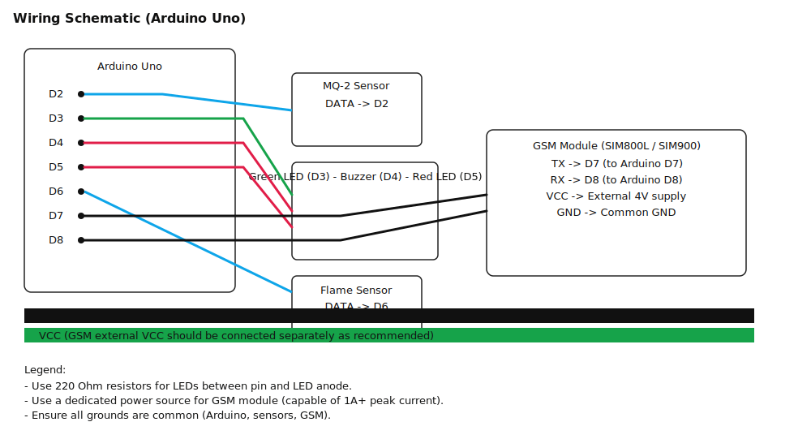

Smoke and Fire Alarm System with GSM SMS Notification

Overview
This project implements a local smoke and flame alarm using an Arduino and a GSM module to send SMS alerts. It reads an MQ-2 smoke/gas sensor and a flame sensor, activates a local buzzer and LEDs on alarm, and sends a configurable SMS message to a preset phone number.

Key Features
- Local audible and visual alarm (buzzer + LEDs)
- Remote SMS notification via SIM800L / SIM900 (or similar)
- Simple pin-based configuration suitable for Arduino Uno and similar boards
- PlatformIO project structure (PlatformIO and Arduino IDE friendly)

Hardware Requirements
- Arduino Uno (or any 5V Arduino compatible with SoftwareSerial)
- GSM module (SIM800L, SIM900, etc.) with an active SIM card capable of sending SMS
- MQ-2 Smoke/Gas sensor
- Flame sensor (analog or digital module variant)
- 5V active buzzer
- 2 LEDs (red and green) and two 220Ω resistors
- Stable power supply for GSM module (external 4V–4.2V for SIM800L recommended) and common grounds
- Breadboard, jumper wires, optional level shifting if required by your GSM module

Software Requirements
- PlatformIO (recommended) or the Arduino IDE
- USB cable for programming the Arduino

Wiring (default pins used in this project)
- Smoke sensor DATA -> digital pin 2
- Buzzer -> digital pin 4
- Red LED (alarm) -> digital pin 5 (through 220Ω resistor to GND)
- Green LED (status) -> digital pin 3 (through 220Ω resistor to GND)
- Flame sensor -> digital pin 6
- GSM TX -> digital pin 7 (to Arduino RX pin used by SoftwareSerial)
- GSM RX -> digital pin 8 (to Arduino TX pin used by SoftwareSerial)
- GSM VCC/GND -> external power (ensure correct voltage and sufficient current)

Wiring Diagram


Caption: default pin mapping and recommended external GSM power connection. Adjust pins in `src/main.cpp` if your board uses different serial pins.

Quick Start
1) Configure
- Edit `src/main.cpp` and set `phoneNumber` to the destination number for alerts (international format recommended).
- Review any `#define` or `const` pin assignments at the top of the file and change pins if needed.

2) Build & Upload (PlatformIO)
```bash
# from project root
platformio run --target upload
```

3) Build & Upload (Arduino IDE)
- Open `src/main.cpp` in the Arduino IDE, select the correct board and port, and click Upload.

Power Recommendations
- GSM modules draw significant peak current during transmission (1A+). Use a dedicated power source (LiPo battery or capable DC supply) for the GSM module and do not power it from the Arduino 5V pin unless the power source can handle peaks.
- Common ground required between Arduino and GSM power supply.

Configuration Notes
- Baud rate: the sketch assumes 9600 baud for the GSM module. Adjust if your module uses a different default.
- SoftwareSerial: this project uses `SoftwareSerial` on pins 7/8. For boards with additional hardware serials (e.g., Mega, Leonardo), prefer hardware serial for reliability.

Testing
- Insert a working SIM with SMS credit and ensure the module registers on the network (check module status LEDs or use AT commands).
- With the serial monitor open at the configured baud rate, you can observe status and AT command responses printed by the sketch.
- To simulate events, trigger the flame sensor or set the MQ-2 threshold low to force an alarm.

Troubleshooting
- GSM module not connected: Confirm TX/RX wiring, baud rate, and that `SoftwareSerial` pins match `src/main.cpp`.
- No SMS sent: verify SIM has credit, check signal strength, and confirm module accepts AT commands (`AT` -> `OK`).
- False positives: calibrate MQ-2 sensitivity and debounce the flame sensor if necessary.
- Power resets or brownouts: provide a stronger power supply to the GSM module and add decoupling capacitors.

Project Layout
- `platformio.ini` — PlatformIO configuration for building/uploading
- `src/main.cpp` — Main application sketch (configure `phoneNumber` and pins here)
- `lib/` — Optional libraries (if present)
- `include/` — Header files (if present)

Contributing
- Feel free to open issues or submit pull requests to improve wiring diagrams, support additional boards, or add non-blocking alarm behavior.

License & Contact
- This project is provided as-is. Add a license file if you want to define reuse terms.
- For questions, include contact info or open an issue in the repo.

—
If you want, I can also add a simple wiring diagram, a PlatformIO example `env`, or update `src/main.cpp` to centralize configuration values at the top of the file.
